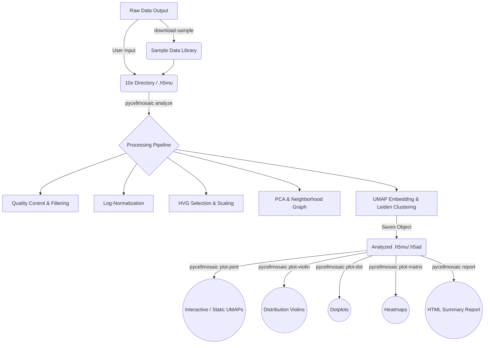

# PyCellMosaic
**Mosaic views for multi-omics single cells**

[](https://badge.fury.io/py/pycellmosaic)
[](https://pypi.org/project/pycellmosaic/)
[](https://opensource.org/licenses/MIT)

**PyCellMosaic** reconstructs rich, integrated visualizations of cellular layers, specializing in advanced multi-omics single-cell visualization and analysis (RNA + ATAC + CITE-seq via MuData). It provides a unified pipeline from raw inputs to processed, multi-modal objects and specialized visualizations.

*Note: Fully supports Arabic text in visualizations via builtin reverse-text-direction fixes for Matplotlib exports.*

## How It Works: The PyCellMosaic Pipeline

The tool is designed to take raw `10x Genomics` outputs or combined `.h5mu`/`.h5ad` files and stream them through a standardized analytical lifecycle:



### Supported File Types

**Input Formats (What it reads):**
- **`.h5mu`**: Natively reads MuData files containing multiple modalities (e.g., `rna` and `atac` assays in the same file).
- **`.h5ad`**: Support for standard AnnData single-cell objects.
- **`10x Genomics Directories`**: Can read raw matrix directories (containing `matrix.mtx`, `barcodes.tsv`, `features.tsv`) directly from cellranger outputs.

**Output Formats (What it makes):**
- **`.h5mu` / `.h5ad`**: Extensively processed and clustered HDF5 single-cell object versions of the inputs.
- **Images (`.pdf`, `.png`, `.svg`)**: Vector and static plots suitable for presentation and publication.
- **Reports (`.html`)**: Complete standalone interactive summaries of the analysis pipeline.

### Pipeline Details
1. **Input & Loading**: The `analyze` function natively reads `MuData` structured matrices. This is critically important for modern single-cell studies as it allows tracking cells that have *both* RNA and accessible Chromatin regions (ATAC) mapped against the exact same barcode.
2. **Preprocessing**: It systematically cleans the data using standard heuristics (filtering out dead cells marked by high mitochondrial counts, dropping cells with too few genes). 
3. **Dimensionality Reduction & Clustering**: The high-dimensional expression matrices are reduced using Principal Component Analysis (PCA), mapped onto a neighborhood graph, and finally clustered into groups using the Leiden algorithm. This assigns a "Cell Type" cluster to every barcode.
4. **Export & Visualization**: The fully annotated `MuData` object is saved, ready to be channeled into identical plotting commands (`plot-joint`, `plot-dot`, etc.) that seamlessly handle drawing visualizations for *any* contained modality just by specifying (`--modality rna` vs `--modality atac`).

## Installation

Install directly from PyPI (once published):

```bash
pip install pycellmosaic
```

## Quick Start

Go from downloading sample data to a beautiful joint report in just a few commands!

```bash
# 1. Download sample multiome data
pycellmosaic download-sample --name pbmc_multiome_10k

# 2. Analyze
pycellmosaic analyze --input sample_data/pbmc_multiome_10k.h5mu --output results/

# 3. Create interactive joint plot
pycellmosaic plot-joint --input results/pbmc_multiome_10k_analyzed.h5mu --color leiden --interactive

# 4. Generate HTML Report
pycellmosaic report --input results/ --html report.html
```

## Command-Line Interface (CLI)

### 1. Data Downloading & Processing

**`download-sample`**
Downloads a sample multiomics dataset to test out the package.
```bash
pycellmosaic download-sample [OPTIONS]
```
*   `--name`, `-n`: Name of the sample dataset (default: `pbmc_multiome_10k`).
*   `--out-dir`, `-o`: Output directory to save the file (default: `sample_data`).

**`analyze`**
Runs the full standard preprocessing and analysis pipeline (QC, normalization, dimension reduction, clustering) on the raw dataset.
```bash
pycellmosaic analyze [OPTIONS]
```
*   `--input`, `-i`: Input `.h5mu`, `.h5ad`, or 10x directory path **(Required)**.
*   `--output`, `-o`: Output directory for the processed data (default: `results`).

### 2. Plotting & Visualization

**`plot-joint`**
Generates a UMAP plot for the data. If multiome embeddings are present, plots the joint UMAP; otherwise gracefully falls back to plotting the primary given modality.


```bash
pycellmosaic plot-joint [OPTIONS]
```
*   `--input`, `-i`: Path to the processed `.h5mu` or `.h5ad` file **(Required)**.
*   `--color`, `-c`: Observation key to color cells by (default: `leiden`).
*   `--interactive`: Whether to use an interactive Plotly plot instead of static matplotlib (default: `False`).
*   `--format`: Format to save the resulting image (default: `pdf`).
*   `--output`, `-o`: Path/filename to save the plot.
*   `--dpi`: Resolution for saved static images (default: `300`).
*   `--title`, `-t`: Optional custom title for the plot.

**`plot-violin`**
Generates a violin plot for a specific feature (gene/peak) to visualize its distribution across different categories.


```bash
pycellmosaic plot-violin [OPTIONS]
```
*   `--input`, `-i`: Path to the processed `.h5mu` or `.h5ad` file **(Required)**.
*   `--feature`, `-f`: A specific feature or gene name to plot **(Required)**.
*   `--modality`, `-m`: The modality containing the feature (default: `rna`).
*   `--groupby`, `-g`: The observation key representing cell categories/clusters to group the violins by (default: `leiden`).
*   `--format`: Format to save the image (default: `pdf`).
*   `--output`, `-o`: Path/filename to save the plot.
*   `--dpi`: Resolution for saved static images (default: `300`).
*   `--title`, `-t`: Optional custom title for the plot.

**`plot-dot`**
Generates a dot plot that visualizes both the average expression level (color) and the fraction of cells expressing the features (dot size) for multiple genes across different groups.


```bash
pycellmosaic plot-dot [OPTIONS]
```
*   `--input`, `-i`: Path to the processed `.h5mu` or `.h5ad` file **(Required)**.
*   `--features`, `-f`: A comma-separated list of features/genes to plot **(Required)**. Example: `LYZ,CD14,GNLY`.
*   `--modality`, `-m`: The modality containing the features (default: `rna`).
*   `--groupby`, `-g`: The observation key representing cell categories to group the dots by (default: `leiden`).
*   `--format`: Format to save the image (default: `pdf`).
*   `--output`, `-o`: Path/filename to save the plot.
*   `--dpi`: Resolution for saved static images (default: `300`).
*   `--title`, `-t`: Optional custom title for the plot.

**`plot-matrix`**
Generates a matrix plot (heatmap) mapping the mean expression for multiple features linearly across groups as color blocks.


```bash
pycellmosaic plot-matrix [OPTIONS]
```
*   `--input`, `-i`: Path to the processed `.h5mu` or `.h5ad` file **(Required)**.
*   `--features`, `-f`: A comma-separated list of features/genes to plot **(Required)**. Example: `LYZ,CD14,GNLY`.
*   `--modality`, `-m`: The modality containing the features (default: `rna`).
*   `--groupby`, `-g`: The observation key representing cell categories to group by (default: `leiden`).
*   `--format`: Format to save the image (default: `pdf`).
*   `--output`, `-o`: Path/filename to save the plot.
*   `--dpi`: Resolution for saved static images (default: `300`).
*   `--title`, `-t`: Optional custom title for the plot.

### 3. Reporting

**`report`**
Generates a summary HTML report of the processed object's metrics. Note that creating complete custom reports requires the `jinja2` package to be installed.
```bash
pycellmosaic report [OPTIONS]
```
*   `--input`, `-i`: Path to the processed `.h5mu` or `.h5ad` file **(Required)**.
*   `--html`: Path to save the resulting HTML report (default: `report.html`).

## Features
- **Multi-omics Integration**: First-class handling of MuData objects.
- **Joint UMAPs**: Seamlessly overlay or side-by-side plot multi-modal embeddings using Plotly or Matplotlib.
- **Various Diagnostic Plots**: Generates violin, dotplot, matrix plots and handles fallback modalities natively.
- **Cross-Layer Correlations**: Discover how specific genes correlate with accessible peaks or protein levels.
- **Automated HTML Reports**: Generate self-contained HTML summaries with Jinja2.
- **Publication Ready Forms**: High DPI, specialized templates (e.g. Nature style), vector exports.

## Examples
See the `examples/` directory for an in-depth Jupyter notebook demonstrating the Python API using 10k PBMC multiome data.

## Project Structure

For developers interested in exploring or contributing to the source code:

```text
pycellmosaic/
├── src/
│   └── pycellmosaic/
│       ├── __init__.py         # Package namespace and warning suppression
│       ├── cli.py              # Typer Command-Line Interface definitions
│       ├── analysis.py         # Core MuData/AnnData QC & Processing algorithms
│       ├── visualization.py    # Matplotlib, Scanpy, and Plotly visualization logic
│       └── utils.py            # Data loading & Downloading utilities
├── tests/
│   └── test_basic.py           # Unit tests for the package
├── setup.py                    # Package metadata and build configuration
├── requirements.txt            # Package dependencies
└── README.md
```
